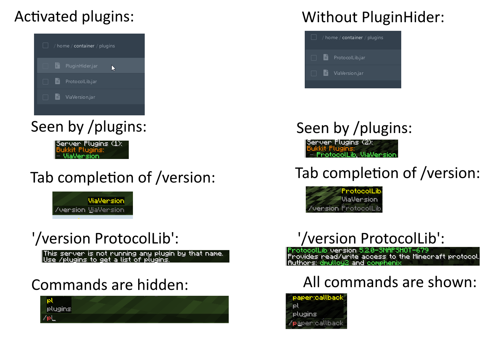

# PluginHider

Hide your minecraft plugins from prying eyes. The commands can still be executed, but it doesn't show up in the tab completion
list. Nor when you issue the `/version <plugin name>` command. Not when you issue the `/plugins` command.

## Required:

! [***PacketEvents v2.4.0+***](https://www.spigotmc.org/resources/packetevents-api.80279/) !

## Configuration

Configuration is relatively simple:

```yaml
hide_plugins:
  - pluginName

show_plugins:
  - '*'

hide_hidden_plugin_commands: true
```

### `hide_plugins`

Anything written in here will be hidden if it matches the name (case-insensitive)

`*` can be used to denote *all* plugins.

### `show_plugins`

By default, it is `*` (ie: show all).

However, if you want to show just 1 plugin, you can set `*` in the `hide_plugins` entry, and the specific name in here.

### `hide_hidden_plugin_commands`

If a plugin is hidden, should we also hide its commands? By default, this is true.

The commands can still be executable, they're just not visible anymore.

## Showcase



## Usage


## Links

- **Spigot**: https://www.spigotmc.org/resources/plugin-hider.117705/
- **bStats**:https://bstats.org/plugin/bukkit/PluginHider/22462
- **GitHub**: https://github.com/AvarionMC/PluginHider
