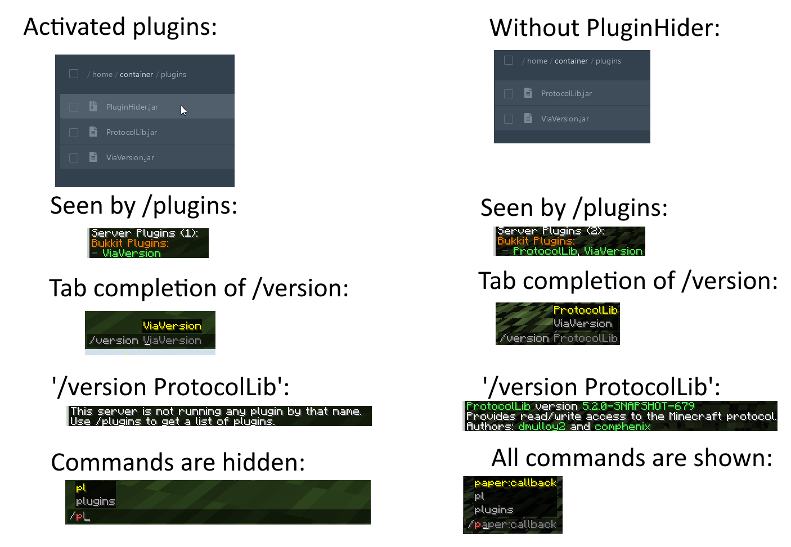

# PluginHider

Hide your Minecraft plugins from prying eyes. The plugin commands can still be executed, but they won't show up in tab
completion, `/version <plugin name>` command results, or when players use the `/plugins` command.

## Requirements

- **Minecraft server:** **Paper 1.21.11** (or a compatible Paper build). PluginHider reproduces
  Paper's own `/plugins` and `/version` output so hidden plugins are indistinguishable from ones
  that aren't installed; it is Paper-only and no longer supports Spigot.
- **Java:** 21 or later.
- **PacketEvents:** [a build recent enough to support your server version](https://www.spigotmc.org/resources/packetevents-api.80279/) (PluginHider is built against ***v2.13.0***; older builds may not know your protocol version).

## Configuration

Configuration is managed through the `config.yml` file:

```yaml
# List of plugins to hide from players. Use '*' to hide all plugins.
# IMPORTANT: Default Minecraft/Bukkit commands remain visible even with '*' unless explicitly hidden.
hide_plugins:
   - PluginHider
   - ProtocolLib
   - packetevents

# List of plugins to show, even if they would otherwise be hidden.
# Takes priority over hide_plugins.
show_plugins:
   - 'MySuperCoolPlugin'

# Controls whether plugin commands can be tab-completed with the plugin name prefix.
# Example: When true, commands can be completed as "pluginname:command"
# When false, only the command name without the plugin prefix will be shown.
should_allow_colon_tabcompletion: false

# List of player UUIDs that always see every plugin and command, in addition to the
# server console. This is the ONLY way to see the full list: operators are treated as
# normal players, so op status never reveals hidden plugins.
whitelisted_uuids:
   - 01234567-89ab-cdef-0123-456789abcdef
```

### Bukkit and Minecraft Commands Visibility

**Important Note:** When using `'*'` in `hide_plugins`, all plugin commands will be hidden **EXCEPT** for default
Minecraft and Bukkit commands.

To explicitly hide Minecraft and Bukkit commands as well:

```yaml
hide_plugins:
   - '*'
   - minecraft
   - bukkit
```

This will make virtually all commands invisible to non-privileged players.

### Configuration Guide

#### Basic Concepts:
- `hide_plugins`: List of plugins to hide
- `show_plugins`: List of plugins to explicitly show
- `'*'` in `hide_plugins`: Hides all plugins not listed in `show_plugins`
- `show_plugins` takes priority over `hide_plugins`

#### Example Scenarios

Let's say you have these plugins installed:
- pluginA
- pluginB
- pluginC
- pluginD
- pluginE

1. **Hide a Single Plugin**  
   To hide only pluginB:
   ```yaml
   hide_plugins:
     - pluginB
   ```
   Result: All plugins except pluginB will be visible

2. **Show Only One Plugin**  
   To show only pluginB:
   ```yaml
   hide_plugins:
     - '*'
   show_plugins:
     - pluginB
   ```
   Result: Only pluginB and default Minecraft/Bukkit commands will be visible

3. **Hide Multiple Specific Plugins**  
   To hide pluginB and pluginD:
   ```yaml
   hide_plugins:
     - pluginB
     - pluginD
   ```
   Result: All plugins except pluginB and pluginD will be visible

4. **Show Only Selected Plugins**  
   To show only pluginA and pluginC:
   ```yaml
   hide_plugins:
     - '*'
   show_plugins:
     - pluginA
     - pluginC
   ```
   Result: Only pluginA, pluginC, and default Minecraft/Bukkit commands will be visible

5. **Hide All Plugins**  
   To hide all plugins except Minecraft/Bukkit commands:
   ```yaml
   hide_plugins:
     - '*'
   ```
   Result: Only default Minecraft/Bukkit commands will be visible

6. **Hide Everything Including Minecraft/Bukkit**  
   To hide absolutely everything:
   ```yaml
   hide_plugins:
     - '*'
     - minecraft
     - bukkit
   ```
   Result: No commands will be visible at all

### Player Permission Control

Only two parties ever see the full, unfiltered list:

- The **server console**.
- Any UUID in **`whitelisted_uuids`**.

**Operators get no special treatment** — an op sees exactly what a normal player sees. This is
deliberate: op status is easy to grant and easy to abuse, so it must never become a way to
enumerate the hidden plugins. If you want a specific person to see everything, add their UUID to
`whitelisted_uuids`.

### Tab Completion Format

- `should_allow_colon_tabcompletion`: Controls whether plugin commands can be tab-completed with the plugin name
  prefix (e.g., "pluginname:command")

## Commands

- `/pluginhider help` - Shows available commands
- `/pluginhider reload` - Reloads the configuration from disk

## Showcase



## Usage


## Links

- **Spigot**: https://www.spigotmc.org/resources/plugin-hider.117705/
- **bStats**: https://bstats.org/plugin/bukkit/PluginHider/22462
- **GitHub**: https://github.com/AvarionMC/PluginHider